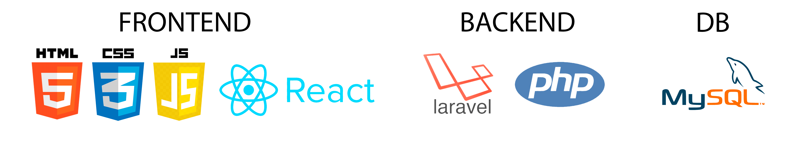
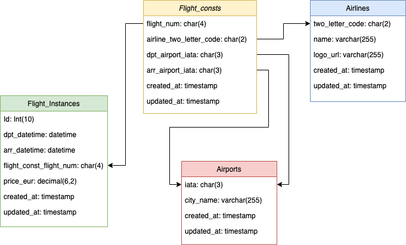
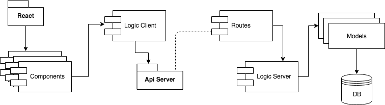
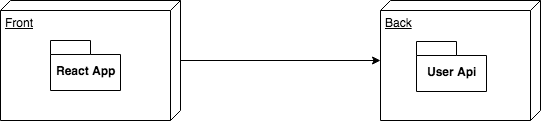

# SkyReader

# Description
SkyReader is an original and the authentic app (the one) to find flights across the europe. 

# Used Language

# Used Technologies

# Used Programs

# Data Model Diagram
 

# Block Model Diagram

# Block Components Diagram

# Authors
- Jaume [GitHub](https://github.com/jaumeserr)

